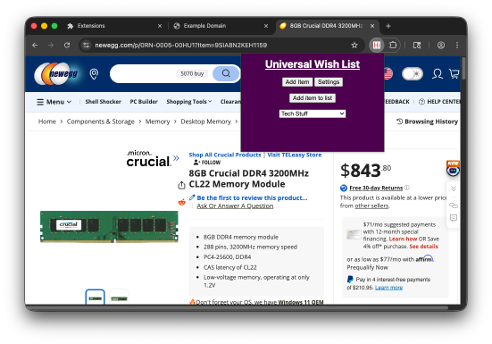

# Universal Wish List Firefox Extension

This is the Firefox extension for Universal Wish List, which allows you to add items to your wish lists without leaving the shopping website.

To add an item on the current website to a wish list, follow the [Installation](#installation) and [Set Up](#set-up) instructions and then just select a list from the dropdown menu and click **Add item to list**.

## Installation

*Instructions taken from the [Firefox first extension tutorial](https://developer.mozilla.org/en-US/docs/Mozilla/Add-ons/WebExtensions/Your_first_WebExtension#trying_it_out).*

1. Clone the repository with `git clone https://github.com/UniversalWishList/firefox-extension.git`.
2. Open Firefox and go to `about:debugging`.
3. Click **This Firefox** from the left sidebar.
4. Click **Load Temporary Add-on** and navigate to the directory where you cloned the repository.
5. Select the `manifest.json` file, although any file should work.

The extension is now cloned, you can access it from the puzzle icon in the top right and, optionally, can pin it for easy access.

*Note that the extension will be removed once Firefox restarts, so you'll have to reinstall it. A persistent version of the extension is coming soon.*

## Loading Changes

On the same page where you installed the extension there is a **Reload** button at the bottom of the extension's info section. Click it to reload the extension to match any changes made in this directory.

## Set Up

1. Follow the [instructions](https://github.com/UniversalWishList/wishlist#creating-an-api-key) in the wishlist repository to generate an API key. Save that API key somewhere safe.
2. Open the extension window by clicking its icon.
3. Click the **Settings** button.
4. Paste your API key into the **API key** field and click **Save API Key**
5. Paste the host address of the Wishlist application into the **Host address** field and click **Save Host Address**.
    - This should look like `http://[IP address of the host computer]:3280`.

## Dev Notes

- View the console log by opening the popup window, right clicking it and selecting **Inspect**. Then select the **Console** panel from the top.

## Sources

- [Wishlist image logo, credits go to "cmintey/wishlist"](https://github.com/cmintey/wishlist/blob/main/src/lib/assets/logo.png)
- [Your first extension - Mozilla | MDN](https://developer.mozilla.org/en-US/docs/Mozilla/Add-ons/WebExtensions/Your_first_WebExtension)
- [Your second extension - Mozilla | MDN](https://developer.mozilla.org/en-US/docs/Mozilla/Add-ons/WebExtensions/Your_second_WebExtension)
- [Permissions | Chrome for Developers](https://developer.chrome.com/docs/extensions/reference/permissions-list)
- [Message passing | Chrome for Developers](https://developer.chrome.com/docs/extensions/develop/concepts/messaging)
- [Handle events with service workers | Get started | Chrome for Developers](https://developer.chrome.com/docs/extensions/get-started/tutorial/service-worker-events)
